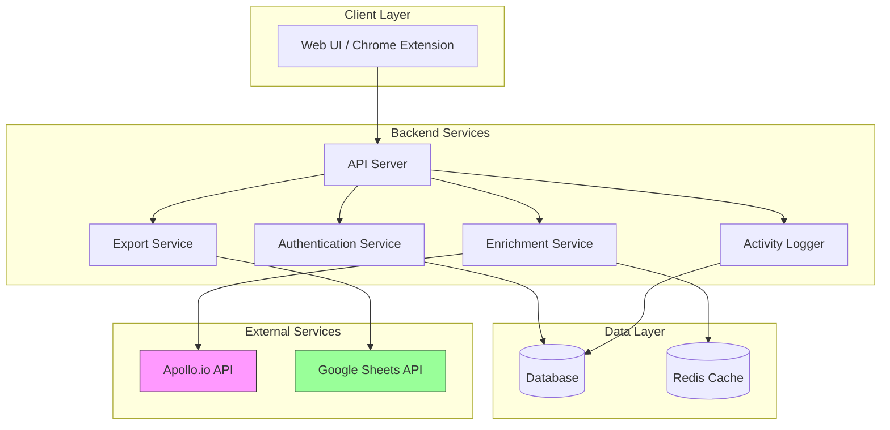

# Design Document: Apollo LinkedIn Prospector

## Overview

El sistema Apollo LinkedIn Prospector es una solución multi-usuario que permite a ejecutivos de prospección extraer y enriquecer datos de leads desde LinkedIn utilizando la API de Apollo.io, con posterior exportación a Google Sheets. El sistema puede implementarse como:

1. **Aplicación Web** (opción recomendada): Mayor flexibilidad, mejor gestión de autenticación y estado
2. **Extensión de Chrome**: Integración directa con LinkedIn, experiencia más fluida

Este diseño se enfoca en la arquitectura de aplicación web con consideraciones para extensión de Chrome donde sea relevante.

## Architecture

### High-Level Architecture



### Technology Stack

**Backend:**
- Runtime: Node.js 20+ con TypeScript
- Framework: Express.js o Fastify
- Database: PostgreSQL (usuarios, logs, configuración)
- Cache: Redis (rate limiting, API responses)
- Authentication: JWT + bcrypt

**Frontend:**
- Framework: React 18+ con TypeScript
- State Management: Zustand o React Context
- UI Library: Tailwind CSS + shadcn/ui
- HTTP Client: Axios

**Chrome Extension (alternativa):**
- Manifest V3
- Service Worker para background tasks
- Content Script para integración con LinkedIn
- Storage API para configuración local

## Components and Interfaces

### 1. Authentication Service

**Responsabilidad:** Gestionar autenticación y sesiones de ejecutivos

**Interfaces:**

```typescript
interface AuthService {
  // Registrar nuevo ejecutivo
  register(data: RegisterData): Promise<User>;
  
  // Autenticar ejecutivo
  login(credentials: LoginCredentials): Promise<AuthResponse>;
  
  // Validar token JWT
  validateToken(token: string): Promise<User>;
  
  // Cerrar sesión
  logout(userId: string): Promise<void>;
  
  // Refrescar token
  refreshToken(refreshToken: string): Promise<AuthResponse>;
}

interface RegisterData {
  email: string;
  password: string;
  fullName: string;
  role: 'executive' | 'admin';
}

interface LoginCredentials {
  email: string;
  password: string;
}

interface AuthResponse {
  accessToken: string;
  refreshToken: string;
  user: User;
  expiresIn: number;
}

interface User {
  id: string;
  email: string;
  fullName: string;
  role: 'executive' | 'admin';
  createdAt: Date;
}
```

**Implementación:**
- Passwords hasheados con bcrypt (salt rounds: 12)
- JWT con expiración de 1 hora para access token
- Refresh token con expiración de 7 días
- Tokens almacenados en httpOnly cookies (web) o chrome.storage (extension)

### 2. Enrichment Service

**Responsabilidad:** Extraer datos de LinkedIn y enriquecerlos con Apollo.io

**Interfaces:**

```typescript
interface EnrichmentService {
  // Enriquecer un solo perfil
  enrichProfile(linkedinUrl: string, userId: string): Promise<EnrichedLead>;
  
  // Enriquecer múltiples perfiles (batch)
  enrichProfiles(linkedinUrls: string[], userId: string): Promise<EnrichmentBatchResult>;
  
  // Verificar créditos disponibles
  checkCredits(): Promise<CreditInfo>;
}

interface EnrichedLead {
  // Datos extraídos
  linkedinUrl: string;
  firstName: string;
  lastName: string;
  fullName: string;
  email: string | null;
  personalEmail: string | null;
  phoneNumber: string | null;
  
  // Información profesional
  title: string;
  company: string;
  companyDomain: string | null;
  industry: string | null;
  location: string;
  
  // Metadata
  enrichedAt: Date;
  creditsConsumed: number;
  apolloId: string | null;
}

interface EnrichmentBatchResult {
  successful: EnrichedLead[];
  failed: FailedEnrichment[];
  totalCreditsConsumed: number;
}

interface FailedEnrichment {
  linkedinUrl: string;
  error: string;
  errorCode: 'NOT_FOUND' | 'INVALID_URL' | 'API_ERROR' | 'RATE_LIMIT';
}

interface CreditInfo {
  remaining: number;
  total: number;
  resetDate: Date | null;
}
```

**Implementación:**

1. **Extracción de LinkedIn URL:**
   - Validar formato de URL (regex pattern)
   - Extraer identificador de perfil (public identifier o vanity URL)
   - Normalizar URL a formato estándar

2. **Llamada a Apollo.io API:**
   - Endpoint: `POST /v1/people/match`
   - Parámetros: `linkedin_url` o combinación de `first_name`, `last_name`, `organization_name`
   - Headers: `X-Api-Key: {APOLLO_API_KEY}`
   - Manejo de rate limiting (429 responses)

3. **Caching:**
   - Cache en Redis con TTL de 24 horas
   - Key format: `apollo:profile:{linkedin_url_hash}`
   - Reducir consumo de créditos para búsquedas repetidas

4. **Error Handling:**
   - Retry con exponential backoff (3 intentos)
   - Circuit breaker para proteger contra fallos de Apollo API
   - Logging detallado de errores

### 3. Export Service

**Responsabilidad:** Exportar leads enriquecidos a Google Sheets

**Interfaces:**

```typescript
interface ExportService {
  // Conectar cuenta de Google
  connectGoogleAccount(userId: string, authCode: string): Promise<GoogleConnection>;
  
  // Listar sheets disponibles
  listSheets(userId: string): Promise<SheetInfo[]>;
  
  // Exportar leads a sheet
  exportLeads(request: ExportRequest): Promise<ExportResult>;
  
  // Configurar campos de exportación
  configureExportFields(userId: string, fields: ExportField[]): Promise<void>;
}

interface GoogleConnection {
  userId: string;
  email: string;
  accessToken: string; // Encrypted
  refreshToken: string; // Encrypted
  expiresAt: Date;
}

interface SheetInfo {
  id: string;
  name: string;
  url: string;
}

interface ExportRequest {
  userId: string;
  sheetId: string;
  leads: EnrichedLead[];
  sheetName?: string; // Tab name, default: "Leads"
  appendMode: boolean; // true = append, false = overwrite
}

interface ExportResult {
  success: boolean;
  rowsAdded: number;
  sheetUrl: string;
  errors: string[];
}

interface ExportField {
  field: keyof EnrichedLead;
  columnName: string;
  enabled: boolean;
  order: number;
}
```

**Implementación:**

1. **OAuth 2.0 Flow:**
   - Scopes: `https://www.googleapis.com/auth/spreadsheets`
   - Redirect URI configurado en Google Cloud Console
   - Tokens encriptados en DB usando AES-256-GCM

2. **Google Sheets API Integration:**
   - Library: `googleapis` npm package
   - Batch updates para mejor performance
   - Manejo de rate limits (100 requests/100 seconds/user)

3. **Data Formatting:**
   - Headers en primera fila
   - Formato de fecha: ISO 8601
   - Validación de datos antes de exportar
   - Escape de caracteres especiales

4. **Error Recovery:**
   - Retry automático en caso de errores transitorios
   - Guardar estado de exportación para retry manual
   - Notificación al usuario en caso de fallo

### 4. Activity Logger

**Responsabilidad:** Registrar todas las operaciones para auditoría

**Interfaces:**

```typescript
interface ActivityLogger {
  // Registrar enriquecimiento
  logEnrichment(log: EnrichmentLog): Promise<void>;
  
  // Registrar exportación
  logExport(log: ExportLog): Promise<void>;
  
  // Obtener logs por usuario
  getUserLogs(userId: string, filters: LogFilters): Promise<ActivityLog[]>;
  
  // Obtener estadísticas
  getStatistics(filters: StatisticsFilters): Promise<Statistics>;
}

interface EnrichmentLog {
  userId: string;
  linkedinUrl: string;
  success: boolean;
  creditsConsumed: number;
  errorMessage?: string;
  timestamp: Date;
}

interface ExportLog {
  userId: string;
  sheetId: string;
  leadsCount: number;
  success: boolean;
  timestamp: Date;
}

interface LogFilters {
  startDate?: Date;
  endDate?: Date;
  success?: boolean;
  limit?: number;
  offset?: number;
}

interface ActivityLog {
  id: string;
  userId: string;
  userName: string;
  action: 'enrichment' | 'export';
  details: Record<string, any>;
  timestamp: Date;
}

interface StatisticsFilters {
  userId?: string;
  startDate?: Date;
  endDate?: Date;
}

interface Statistics {
  totalEnrichments: number;
  totalCreditsConsumed: number;
  successRate: number;
  byUser: UserStatistics[];
}

interface UserStatistics {
  userId: string;
  userName: string;
  enrichments: number;
  creditsConsumed: number;
}
```

### 5. Configuration Service

**Responsabilidad:** Gestionar configuración del sistema

**Interfaces:**

```typescript
interface ConfigService {
  // Configurar API key de Apollo
  setApolloApiKey(key: string): Promise<void>;
  
  // Obtener API key (solo para uso interno)
  getApolloApiKey(): Promise<string>;
  
  // Validar API key
  validateApolloApiKey(key: string): Promise<boolean>;
  
  // Configurar OAuth de Google
  setGoogleOAuthConfig(config: GoogleOAuthConfig): Promise<void>;
}

interface GoogleOAuthConfig {
  clientId: string;
  clientSecret: string;
  redirectUri: string;
}
```

**Implementación:**
- Configuración almacenada en variables de entorno + DB
- API key de Apollo encriptada en DB
- Validación mediante test API call a Apollo
- Solo usuarios admin pueden modificar configuración

## Data Models

### Database Schema (PostgreSQL)

```sql
-- Tabla de usuarios
CREATE TABLE users (
  id UUID PRIMARY KEY DEFAULT gen_random_uuid(),
  email VARCHAR(255) UNIQUE NOT NULL,
  password_hash VARCHAR(255) NOT NULL,
  full_name VARCHAR(255) NOT NULL,
  role VARCHAR(20) NOT NULL CHECK (role IN ('executive', 'admin')),
  created_at TIMESTAMP DEFAULT CURRENT_TIMESTAMP,
  updated_at TIMESTAMP DEFAULT CURRENT_TIMESTAMP
);

-- Tabla de sesiones/tokens
CREATE TABLE sessions (
  id UUID PRIMARY KEY DEFAULT gen_random_uuid(),
  user_id UUID REFERENCES users(id) ON DELETE CASCADE,
  refresh_token VARCHAR(500) UNIQUE NOT NULL,
  expires_at TIMESTAMP NOT NULL,
  created_at TIMESTAMP DEFAULT CURRENT_TIMESTAMP
);

-- Tabla de conexiones de Google
CREATE TABLE google_connections (
  id UUID PRIMARY KEY DEFAULT gen_random_uuid(),
  user_id UUID REFERENCES users(id) ON DELETE CASCADE UNIQUE,
  google_email VARCHAR(255) NOT NULL,
  access_token_encrypted TEXT NOT NULL,
  refresh_token_encrypted TEXT NOT NULL,
  expires_at TIMESTAMP NOT NULL,
  created_at TIMESTAMP DEFAULT CURRENT_TIMESTAMP,
  updated_at TIMESTAMP DEFAULT CURRENT_TIMESTAMP
);

-- Tabla de leads enriquecidos
CREATE TABLE enriched_leads (
  id UUID PRIMARY KEY DEFAULT gen_random_uuid(),
  user_id UUID REFERENCES users(id) ON DELETE CASCADE,
  linkedin_url VARCHAR(500) NOT NULL,
  first_name VARCHAR(100),
  last_name VARCHAR(100),
  full_name VARCHAR(255),
  email VARCHAR(255),
  personal_email VARCHAR(255),
  phone_number VARCHAR(50),
  title VARCHAR(255),
  company VARCHAR(255),
  company_domain VARCHAR(255),
  industry VARCHAR(100),
  location VARCHAR(255),
  apollo_id VARCHAR(100),
  credits_consumed INTEGER NOT NULL,
  enriched_at TIMESTAMP DEFAULT CURRENT_TIMESTAMP,
  UNIQUE(user_id, linkedin_url)
);

-- Tabla de logs de actividad
CREATE TABLE activity_logs (
  id UUID PRIMARY KEY DEFAULT gen_random_uuid(),
  user_id UUID REFERENCES users(id) ON DELETE CASCADE,
  action VARCHAR(50) NOT NULL,
  details JSONB NOT NULL,
  success BOOLEAN NOT NULL,
  credits_consumed INTEGER DEFAULT 0,
  created_at TIMESTAMP DEFAULT CURRENT_TIMESTAMP
);

CREATE INDEX idx_activity_logs_user_id ON activity_logs(user_id);
CREATE INDEX idx_activity_logs_created_at ON activity_logs(created_at);
CREATE INDEX idx_enriched_leads_user_id ON enriched_leads(user_id);

-- Tabla de configuración
CREATE TABLE system_config (
  key VARCHAR(100) PRIMARY KEY,
  value_encrypted TEXT NOT NULL,
  updated_at TIMESTAMP DEFAULT CURRENT_TIMESTAMP,
  updated_by UUID REFERENCES users(id)
);
```

### Redis Cache Structure

```
# Cache de perfiles enriquecidos
apollo:profile:{url_hash} -> JSON(EnrichedLead)
TTL: 86400 seconds (24 hours)

# Rate limiting
ratelimit:apollo:global -> Counter
TTL: 60 seconds

# Información de créditos
apollo:credits -> JSON(CreditInfo)
TTL: 300 seconds (5 minutes)

# Sesiones activas
session:{user_id} -> JSON(SessionData)
TTL: 3600 seconds (1 hour)
```

## Correctness Properties

*Una propiedad es una característica o comportamiento que debe mantenerse verdadero en todas las ejecuciones válidas del sistema - esencialmente, una declaración formal sobre lo que el sistema debe hacer. Las propiedades sirven como puente entre especificaciones legibles por humanos y garantías de corrección verificables por máquinas.*

### Authentication Properties

**Property 1: Valid credentials create sessions**
*For any* executive with valid credentials, authenticating should create a valid session with a non-expired token.
**Validates: Requirements 1.1**

**Property 2: Invalid credentials are rejected**
*For any* invalid credentials (wrong password, non-existent email, malformed input), authentication should fail and return an appropriate error without creating a session.
**Validates: Requirements 1.2**

**Property 3: Logout terminates sessions**
*For any* authenticated session, logging out should terminate the session and invalidate all associated tokens, preventing further authenticated operations.
**Validates: Requirements 1.3**

**Property 4: User data isolation**
*For any* two different executives, their profile data, enriched leads, and activity logs should be completely isolated with no cross-contamination.
**Validates: Requirements 1.4**

### LinkedIn URL Processing Properties

**Property 5: Valid LinkedIn URLs are parsed correctly**
*For any* valid LinkedIn profile URL (various formats: /in/username, /pub/username, with or without trailing slashes), the system should correctly extract the profile identifier.
**Validates: Requirements 2.1**

**Property 6: Invalid URLs are rejected without API calls**
*For any* invalid or malformed LinkedIn URL, the system should reject it with an error message and should not make any Apollo API calls or consume credits.
**Validates: Requirements 2.4**

**Property 7: API response parsing consistency**
*For any* valid Apollo API response containing lead data, the system should parse and structure all available fields consistently, with no data loss or corruption.
**Validates: Requirements 2.3**

**Property 8: Batch processing completeness**
*For any* batch of LinkedIn URLs submitted together, the system should process each URL exactly once and return results for all URLs (either success or specific failure reason).
**Validates: Requirements 2.6**

### Credit Management Properties

**Property 9: Shared API key usage**
*For any* executive making an API request, the system should use the same shared Apollo API key, regardless of which executive initiated the request.
**Validates: Requirements 3.2**

**Property 10: Credit consumption tracking**
*For any* API request that consumes credits, the system should log the exact executive who made the request, the timestamp, and the number of credits consumed.
**Validates: Requirements 3.3**

**Property 11: Not-found profiles don't consume credits**
*For any* LinkedIn profile that is not found in Apollo.io's database, the system should mark it as "not found" and should not consume any credits.
**Validates: Requirements 7.3**

### Export Properties

**Property 12: Permission verification before export**
*For any* Google Sheet selected for export, the system should verify write permissions before attempting to export data, and should reject sheets without proper permissions.
**Validates: Requirements 4.2**

**Property 13: Data formatting consistency**
*For any* enriched lead data being exported, the system should format it according to the configured spreadsheet structure with all selected fields present and properly formatted.
**Validates: Requirements 4.3**

**Property 14: Export appends data correctly**
*For any* export operation in append mode, the system should add new rows to the sheet without modifying or deleting existing data.
**Validates: Requirements 4.4**

**Property 15: Export field configuration**
*For any* configured set of export fields, only the enabled fields should appear in the exported data, in the specified order.
**Validates: Requirements 4.6**

**Property 16: Batch export operations**
*For any* export of multiple leads, the system should batch the operations appropriately to stay within Google Sheets API rate limits.
**Validates: Requirements 4.7**

**Property 17: Export error recovery**
*For any* export operation that fails due to Google Sheets API errors, the system should retain the lead data and allow retry without data loss.
**Validates: Requirements 4.5**

### Activity Logging Properties

**Property 18: Complete activity logging**
*For any* API request made by an executive, the system should log all required fields: executive identifier, timestamp, LinkedIn URL, credits consumed, and success/failure status.
**Validates: Requirements 6.1**

**Property 19: Log filtering accuracy**
*For any* log query with filters (executive, date range, or both), the system should return only logs that match all specified filter criteria.
**Validates: Requirements 6.3**

**Property 20: Credit aggregation accuracy**
*For any* executive, the total credits consumed calculated by the system should equal the sum of all credits consumed in their individual activity logs.
**Validates: Requirements 6.4**

**Property 21: CSV export format**
*For any* activity log export to CSV, the output should be valid CSV format with proper escaping, headers, and all log data present.
**Validates: Requirements 6.5**

### Error Handling Properties

**Property 22: Rate limit queueing**
*For any* API request that receives a rate limit error (429), the system should queue the request and retry it after the specified delay period.
**Validates: Requirements 7.1**

**Property 23: Network error retry with backoff**
*For any* network error during API calls, the system should retry up to 3 times with exponential backoff before failing permanently.
**Validates: Requirements 7.4**

**Property 24: API error logging completeness**
*For any* API error that occurs, the system should log sufficient detail (error code, message, request parameters, timestamp) to enable debugging.
**Validates: Requirements 7.5**

### Configuration Properties

**Property 25: API key validation on update**
*For any* Apollo API key update, the system should validate the key by making a test API call before accepting and storing the new key.
**Validates: Requirements 8.2**

**Property 26: Configuration hot-reload**
*For any* configuration change, the system should apply the new configuration immediately without requiring a system restart.
**Validates: Requirements 8.5**

## Error Handling

### Error Categories

1. **Authentication Errors**
   - Invalid credentials
   - Expired tokens
   - Insufficient permissions
   - Response: 401 Unauthorized with descriptive message

2. **Validation Errors**
   - Invalid LinkedIn URL format
   - Missing required fields
   - Invalid configuration
   - Response: 400 Bad Request with field-specific errors

3. **External API Errors**
   - Apollo API failures (500, 503)
   - Google Sheets API failures
   - Rate limiting (429)
   - Response: 502 Bad Gateway or 503 Service Unavailable with retry guidance

4. **Resource Errors**
   - Insufficient credits
   - Sheet not found
   - Permission denied
   - Response: 403 Forbidden or 404 Not Found

5. **System Errors**
   - Database connection failures
   - Redis unavailable
   - Unexpected exceptions
   - Response: 500 Internal Server Error with error ID for tracking

### Error Response Format

```typescript
interface ErrorResponse {
  error: {
    code: string; // Machine-readable error code
    message: string; // Human-readable message
    details?: Record<string, any>; // Additional context
    requestId: string; // For tracking
    timestamp: Date;
  };
}
```

### Retry Strategy

```typescript
interface RetryConfig {
  maxAttempts: 3;
  baseDelay: 1000; // ms
  maxDelay: 10000; // ms
  backoffMultiplier: 2;
  retryableErrors: [
    'NETWORK_ERROR',
    'TIMEOUT',
    'RATE_LIMIT',
    'SERVICE_UNAVAILABLE'
  ];
}
```

### Circuit Breaker

Para proteger contra fallos en cascada de Apollo API:

- **Threshold:** 5 fallos consecutivos
- **Timeout:** 60 segundos
- **Half-open:** Permitir 1 request de prueba después del timeout
- **Reset:** Después de 3 requests exitosos consecutivos

## Testing Strategy

### Unit Testing

**Framework:** Jest con TypeScript

**Coverage mínima:** 80% de cobertura de código

**Áreas de enfoque:**
- Validación de URLs de LinkedIn (regex patterns, edge cases)
- Parsing de respuestas de Apollo API
- Formateo de datos para Google Sheets
- Lógica de retry y circuit breaker
- Encriptación/desencriptación de tokens
- Cálculos de agregación de créditos

**Ejemplo de test unitario:**

```typescript
describe('LinkedIn URL Validator', () => {
  it('should accept valid LinkedIn profile URLs', () => {
    const validUrls = [
      'https://www.linkedin.com/in/johndoe',
      'https://linkedin.com/in/jane-doe-123',
      'https://www.linkedin.com/pub/john-doe/1/2/3'
    ];
    
    validUrls.forEach(url => {
      expect(validateLinkedInUrl(url)).toBe(true);
    });
  });
  
  it('should reject invalid URLs', () => {
    const invalidUrls = [
      'https://facebook.com/johndoe',
      'not-a-url',
      'https://linkedin.com/company/acme'
    ];
    
    invalidUrls.forEach(url => {
      expect(validateLinkedInUrl(url)).toBe(false);
    });
  });
});
```

### Property-Based Testing

**Framework:** fast-check (para JavaScript/TypeScript)

**Configuración:** Mínimo 100 iteraciones por test

**Propiedades a testear:**

1. **Authentication Round-trip:** Para cualquier usuario válido, crear sesión → validar token → logout debería funcionar sin errores
2. **URL Parsing Idempotence:** Para cualquier URL válida, parsear → normalizar → parsear debería dar el mismo resultado
3. **Credit Tracking Consistency:** La suma de créditos en logs individuales debe igualar el total agregado
4. **Export Data Integrity:** Para cualquier conjunto de leads, exportar → leer desde sheet debería recuperar los mismos datos
5. **Batch Processing Completeness:** Para cualquier batch de N URLs, el resultado debe contener exactamente N respuestas

**Ejemplo de property test:**

```typescript
import fc from 'fast-check';

describe('Property: Credit tracking consistency', () => {
  it('should maintain credit sum consistency across logs', () => {
    // Feature: apollo-linkedin-prospector, Property 20: Credit aggregation accuracy
    fc.assert(
      fc.property(
        fc.array(fc.record({
          userId: fc.uuid(),
          creditsConsumed: fc.integer({ min: 1, max: 10 })
        }), { minLength: 1, maxLength: 100 }),
        async (logs) => {
          // Insert logs into database
          await insertActivityLogs(logs);
          
          // Calculate expected total per user
          const expectedTotals = logs.reduce((acc, log) => {
            acc[log.userId] = (acc[log.userId] || 0) + log.creditsConsumed;
            return acc;
          }, {} as Record<string, number>);
          
          // Get actual totals from system
          for (const [userId, expectedTotal] of Object.entries(expectedTotals)) {
            const actualTotal = await getCreditsConsumedByUser(userId);
            expect(actualTotal).toBe(expectedTotal);
          }
        }
      ),
      { numRuns: 100 }
    );
  });
});
```

### Integration Testing

**Áreas de enfoque:**
- Flujo completo: Login → Enrich → Export
- Integración con Apollo API (usando API de staging si está disponible)
- Integración con Google Sheets API (usando sheets de prueba)
- Manejo de rate limits y retries
- Persistencia de datos en PostgreSQL

### End-to-End Testing

**Framework:** Playwright (para aplicación web) o Puppeteer (para extensión Chrome)

**Escenarios:**
1. Usuario nuevo se registra, conecta Google, enriquece perfil, exporta a sheet
2. Múltiples usuarios concurrentes consumiendo créditos compartidos
3. Manejo de errores de API y recuperación
4. Exportación de grandes volúmenes de datos (100+ leads)

### Performance Testing

**Herramientas:** k6 o Artillery

**Métricas objetivo:**
- Tiempo de respuesta de enriquecimiento: < 2 segundos (p95)
- Tiempo de exportación (10 leads): < 3 segundos (p95)
- Throughput: 50 requests/segundo
- Tasa de error: < 1%

**Escenarios de carga:**
- 10 usuarios concurrentes durante 5 minutos
- Picos de 50 usuarios durante 1 minuto
- Procesamiento batch de 100 URLs

## Implementation Notes

### Security Considerations

1. **API Key Storage:**
   - Apollo API key encriptada con AES-256-GCM
   - Key de encriptación en variable de entorno (nunca en código)
   - Rotación de keys cada 90 días

2. **Password Security:**
   - bcrypt con 12 salt rounds
   - Política de contraseñas: mínimo 8 caracteres, 1 mayúscula, 1 número
   - Rate limiting en endpoint de login: 5 intentos por 15 minutos

3. **Token Security:**
   - JWT con algoritmo HS256
   - Tokens en httpOnly cookies (web) o chrome.storage.local (extension)
   - Refresh token rotation en cada uso

4. **Google OAuth:**
   - Tokens encriptados antes de almacenar en DB
   - Scopes mínimos necesarios
   - Validación de redirect URI

### Performance Optimizations

1. **Caching:**
   - Cache de perfiles enriquecidos en Redis (24h TTL)
   - Cache de información de créditos (5min TTL)
   - Cache de configuración del sistema

2. **Database:**
   - Índices en columnas frecuentemente consultadas
   - Connection pooling (max 20 conexiones)
   - Prepared statements para prevenir SQL injection

3. **API Calls:**
   - Batch requests cuando sea posible
   - Request deduplication para URLs duplicadas
   - Connection pooling para HTTP clients

### Deployment Considerations

**Aplicación Web:**
- Containerización con Docker
- Deployment en plataformas como Heroku, Railway, o AWS ECS
- Variables de entorno para configuración
- Health check endpoint: `/health`

**Extensión Chrome:**
- Build con Webpack o Vite
- Manifest V3 compliance
- Publicación en Chrome Web Store
- Auto-update habilitado

### Monitoring and Observability

1. **Logging:**
   - Structured logging con Winston o Pino
   - Log levels: ERROR, WARN, INFO, DEBUG
   - Logs centralizados (CloudWatch, Datadog, etc.)

2. **Metrics:**
   - API response times
   - Credit consumption rate
   - Error rates por tipo
   - Active users

3. **Alerting:**
   - Apollo API failures > 5% en 5 minutos
   - Créditos restantes < 100
   - Error rate > 2%
   - Database connection failures

